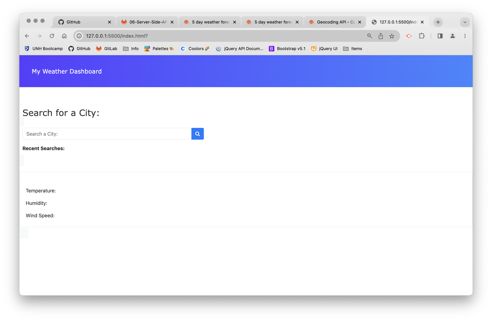
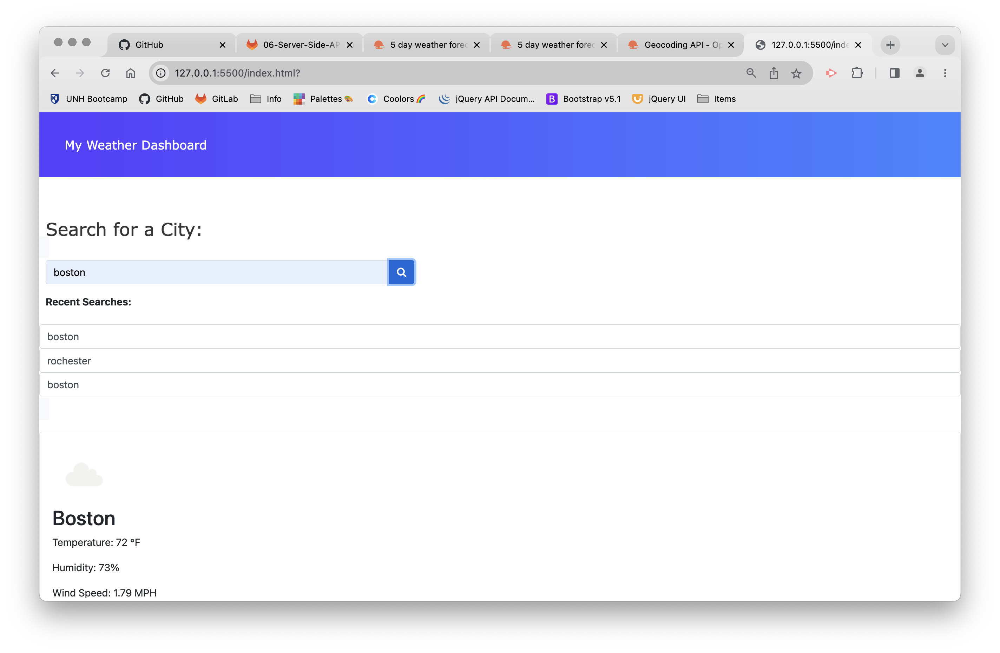
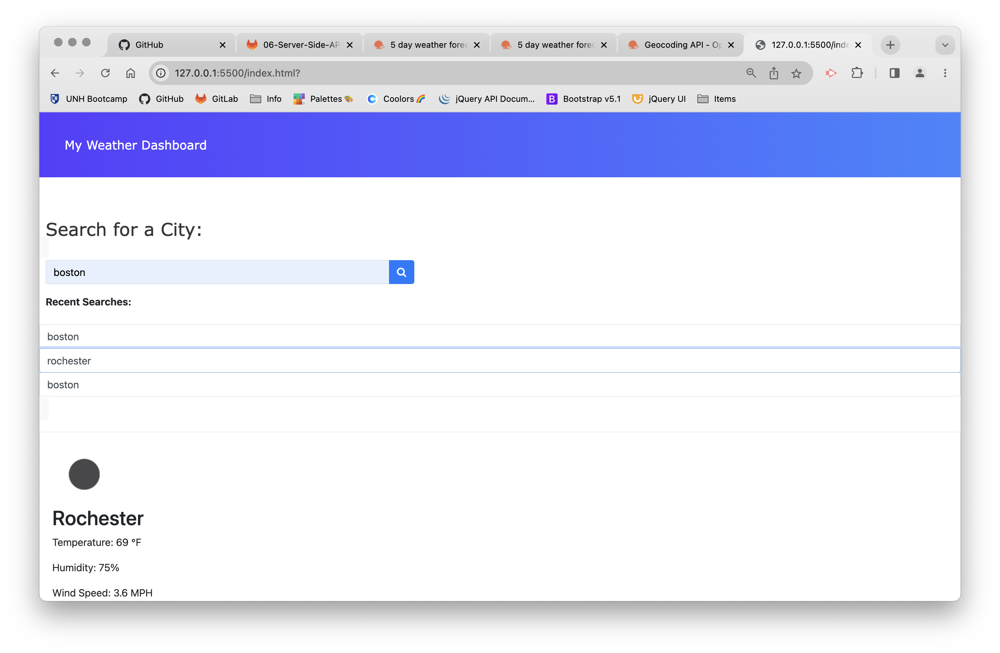

# danielles-dynamic-weather-app

## Description
This weather dashboard was a project to test what we have learned on server side APIs. I went with the Open Weather API. I wanted to keep a modern look with this webpage and create something that people can use daily. Open Weather API offers abundent documentaion and numerous other APIs that may come in handy for feature upgrades.

## Installation
No installation necessary, can be accessed through any browser

## Usage
Check your local weather or another location simply by typing in the city's name and clicking the search button. This allows you to view current weather as well as a 5 day forecast.

## Images and link

https://dmb-leb.github.io/danielles-dynamic-weather-app/ 
